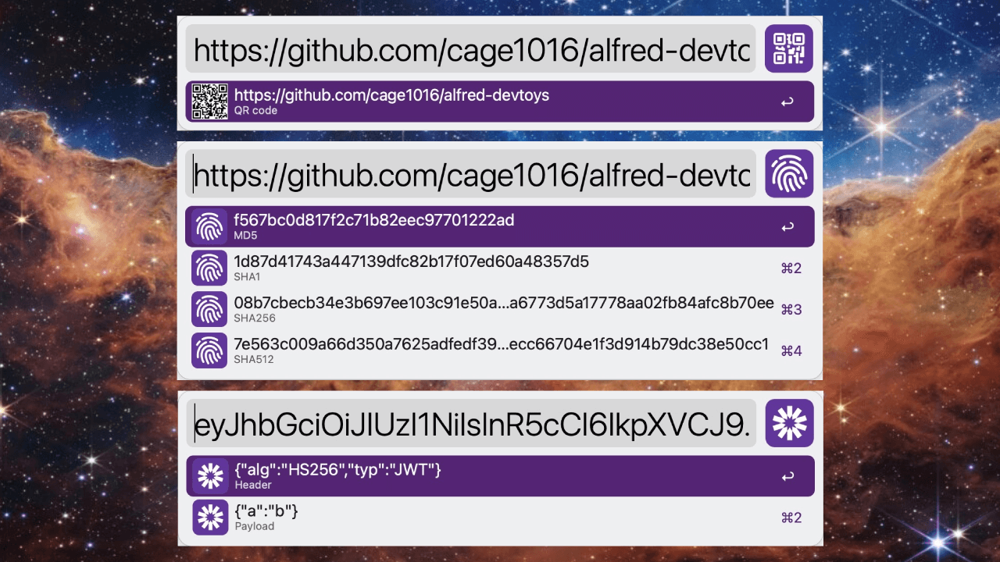

# alfred devtoys

A Swiss Army knife for developers for Alfred

## Why

[DevToys for Windows](https://devtoys.app/) and [DevToysMac](https://github.com/ObuchiYuki/DevToysMac) provide awesome a Swiss Army knife for developers. It's more productivity to do those things without copy and paste between applications.

## Features

- **Encode** - Encode string to `Base64`, `URL` and `HTML`
- **Decode** - Decode string from `Base64`, `URL` and `HTML`
- **Hash** - Hash string as `MD5`, `SHA1`, `SHA256`, `SHA512`
- **JWT** - JWT Decoder for `Header`, `Payload`
- **CheckSum** - `MD5`, `SHA1`, `SHA256`, `SHA512` file checksum
- **UUID** - Generate `UUID`
- **Lorem Ipsum** - Generate `Lorem Ipsum` text (words, sentences, paragraphs)
- **QR Code** - Create QR code
- **Case** - Convert string to `camel`, `constant`, `dot`, `lower`, `lcfirst`, `no`, `param`, `pascal`, `path`, `sentence`, `snake`, `swap`, `title`, `upper`, `ucfirst` and `hashtag` case
- **Number Base** - Base conversion between `decimal`, `hex`, `octal` and `binary`
- **JSON** - JSON formatting as `tab`,  `2 spaces`, `4 spaces` indents and `minify`
- **Base64 Image** - Imgage Base64 Encode as `Base64 string`,`Base64 Data URI`, `HTML  code` and `CSS Background Source`
## Download
Make sure to download the latest released directly from the releases page. [Download here](https://github.com/cage1016/alfred-devtoys/releases).

## Requires
- Preferably Alfred 5

## Configuration
- QR Code Image size

## Encode
use `encode` keyword to Encode string to `Base64`, `URL` and `HTML`

## Decode
use `decode` keyword to Decode string from `Base64`, `URL` and `HTML`

## Hash
use `hash` keyword to Hash string as `MD5`, `SHA1`, `SHA256`, `SHA512`

## JWT
use `jwt` keyword to decode JWT token for `Header`, `Payload`

## CheckSum
use `checksum` keyword to get `MD5`, `SHA1`, `SHA256`, `SHA512` file checksum

## UUID
use `uuid` keyword to generate `UUID`

## Lorem Ipsum
use `li` keyword to generate `Lorem Ipsum` text (words, sentences, paragraphs)

## QR Code
use `qrcode` keyword to generate QR code

## Case

use `cc command` or `cc <pattern>` keyword to case string

|keyword|Explanation|
|--|--|
|`cc commands`| list camel, constant, dot, lower, lcfirst, no, param, pascal, path, sentence, snake, swap, title, upper, ucfirst, hashtag All|
|`cc camel`| Convert to a string with the separators denoted by having the next letter capitalized|
|`cc constant`| Convert to an upper case, underscore separated string|
|`cc dot`| Convert to a lower case, period separated string|
|`cc lower`| Convert to a string in lower case|
|`cc lcfirst`| Convert to a string with the first character lower cased|
|`cc no`| Convert the string without any casing (lower case, space separated)|
|`cc param`| Convert to a lower case, dash separated string|
|`cc pascal`| Convert to a string denoted in the same fashion as camelCase, but with the first letter also capitalized|
|`cc path`| Convert to a lower case, slash separated string|
|`cc sentence`| Convert to a lower case, space separated string|
|`cc snake`| Convert to a lower case, underscore separated string|
|`cc swap`| Convert to a string with every character case reversed|
|`cc title`| Convert to a space separated string with the first character of every word upper cased|
|`cc upper`| Convert to a string in upper case|
|`cc ucfirst`| Convert to a string with the first character upper cased|
|`cc hashtag`| Convert to a string, space separated string with hashtag symbols|

## Number Base
use `nb command` or `nb <pattern>` keyword to convert number to other base

|keyword|Explanation|
|--|--|
|`nb decimal`| Convert `decimal` to `binary`, `octal` and `hexadecimal` |
|`nb binary`| Convert `binary` to `decimal`, `octal` and `hexadecimal` |
|`nb octal`| Convert `octal` to `decimal`, `binary` and `hexadecimal` |
|`nb hexadecimal`| Convert `hexadecimal` to `decimal`, `binary` and `octal` |

## JSON

use `json format` keyword to format JSON as `tab`,  `2 spaces` `4 spaces` indents and `minify`

## Image Base64 Encoder

use `imgbase64f` to find and open with Img Base64 Encode as `Base64 string`,`Base64 Data URI`, `HTML  code` and `CSS Background Source`

- Support `png`, `bmp`, `gif`, `jpeg`, `webp`, `svg` and `tiff` image format
- Universal Action
- File Filter
- File Action

## Third Party Libraries

- [ku/go-change-case: a golang port of npm package change-case](https://github.com/ku/go-change-case)
- [go-loremipsum/loremipsum: A lorem ipsum generator for Go](https://github.com/go-loremipsum/loremipsum)
- [boombuler/barcode: a barcode creation lib for golang](https://github.com/boombuler/barcode)
- [tidwall/pretty: Efficient JSON beautifier and compactor for Go](https://github.com/tidwall/pretty)

## Change Log

### 1.4.0
- Add image Base64 Encode as `Base64 string`,`Base64 Data URI`, `HTML  code` and `CSS Background Source`

### 1.3.0
- Add `amd64` & `arm64` support

### 1.2.0
- Add JSON format as `tab`,  `2 spaces`, `4 spaces` indents and `minify` functions
- Revised `info.plist` items

### 1.1.0
- Revised `qrcode` keyword default action as Browse in Alfred

### 1.0.1
- Fix `qrcode` hit enter does not copy file to clipboard
- Revised workflow description

### 1.0.0
- Initial release

## License
This project is licensed under the MIT License. See [LICENSE](LICENSE) for details.